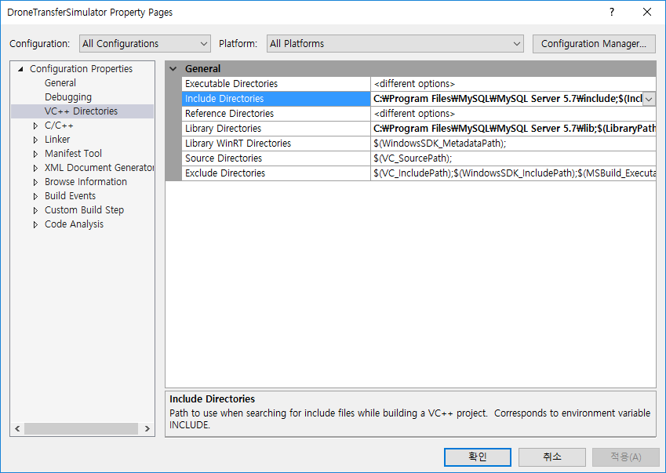
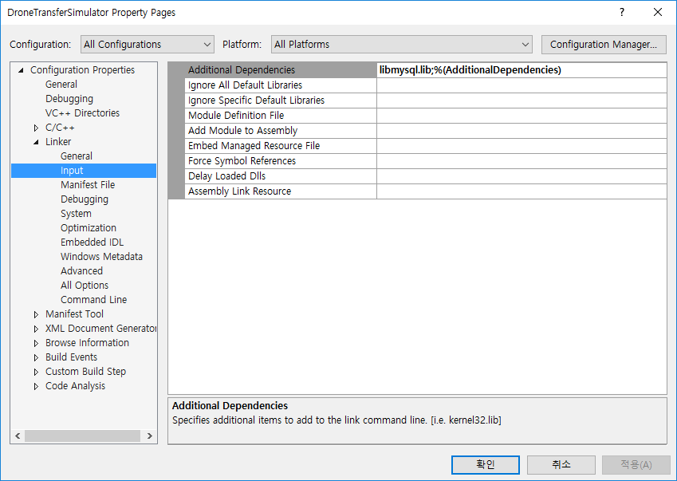
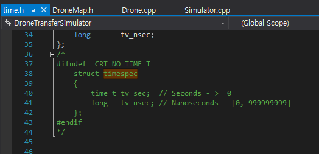

# DroneTransferSimulator 

### 1. DroneMap ###

From **QuantizeCity** by *wonseokdjango*, we're able to access **Seoul\_40x40\_500x500** from *prism.snu.ac.kr*. We have to make DBMS based on MySQL in C++ environment.

#### To connect MySQL & C/C++ (Visual Studio 2015)

> Download MySQL server

1. [dev.mysql.com](dev.mysql.com)
2. downloads -> MySQL Community Edition -> [MySQL Community Server](https://dev.mysql.com/downloads/windows/installer/)
3. MySQL Installer 5.7 for windows: Windows(x86, 32-bit), MySQL Installer MSI download
 - (64-bit version included)
4. Start downloading MySQL installer
 - Click "**No thanks, just start my download.**"
5. Choose setup as ***Server only***
 

> Project environment settings

1. Create an empty C++ project in Visual Studio 2015.
2. Should change build type same as your system.
 - 
3. Modify project settings
 - Add MySQL Server include directory to VC++ Directories -> Include Directories: *C:\ProgramFiles\MySQL\MySQL Server 5.7\include*
 - Add MySQL Server lib directory to VC++ Directories -> Library Directories: *C:\ProgramFiles\MySQL\MySQL Server 5.7\lib*
 
 - Add MySQL Server lib to VC++ Directories -> Library Directories: *libmysql.lib*
 
4. copy **libmysql.dll** from *C:\Program Files\MySQL\MySQL Server 5.7\lib* to project directory
5. Build and fix bugs about redefinition in both *time.h* and *my_global.h*
 - Run Visual Studio as administrator
 - In *time.h*, annotate `struct timespec` definition
 - 

----------
