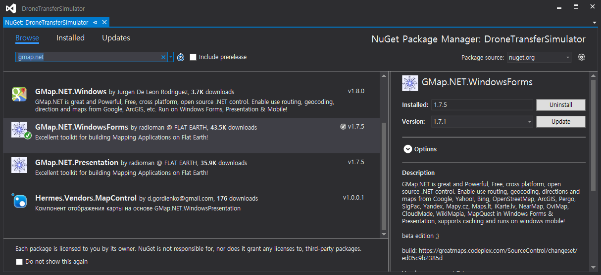

# DroneTransferSimulator 

### 1. DroneMap ###

From **QuantizeCity** by *wonseokdjango*, we're able to access **Seoul\_40x40\_500x500** from *prism.snu.ac.kr*. We have to make DBMS based on MySQL in C# environment.

#### To connect MySQL & C# project (Visual Studio 2015)

> Download MySQL server

1. [dev.mysql.com](dev.mysql.com)
2. downloads -> MySQL Connectors -> [Download Connector/Net](https://dev.mysql.com/downloads/connector/net/)
3. Windows (x86, 32-bit), MSI Installer(6.9.9 ver) download
4. Start downloading MSI Installer
 - Click "**No thanks, just start my download.**"

> C# project environment settings

1. Create a C# project as Console or Windows Form type.
2. Add a MySQL Data reference to the project.
 - Project(*right click*) -> Add -> Reference
 - Search MySql and apply **MySql.Data**

----------

### 2. GMap.net for Windows Form ###

We used Google map to show events' position and routes, edit drone stations during Drone Transfer Simulation. This describes how to include packages to the project.

#### To include GMap.net package

> C# project package installation

1. Install GMap.NET.WindowsForms
 - Project(*menu*) -> Manage NuGet Packages
 - Install GMap.NET.WindowsForms(1.7.5 ver)

----------

